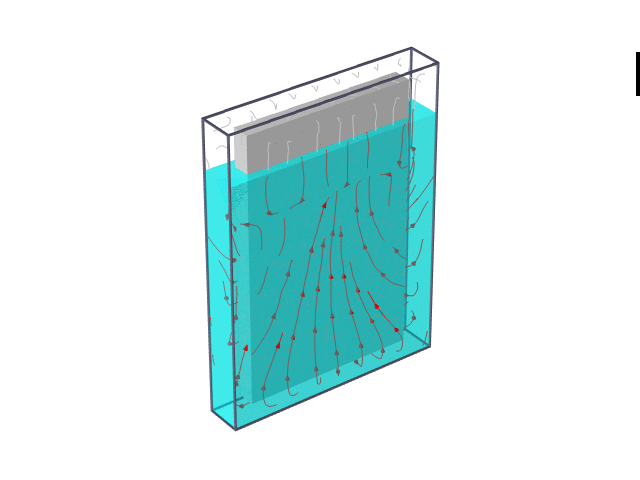

# Strengthening Structures Against Earthquakes

## Introduction

This repository contains the project files for the MECH491 course at Koç University, focusing on the application of Viscous Wall Dampers (VWDs) to reinforce structures against earthquakes.

## Contents

- `Earthquake`: Data and analyses pertaining to earthquake dynamics and the response of structures.
- `Tracking`: Scripts and algorithms developed for tracking the performance of VWDs.
- `Transfer Functions`: Calculations and simulations that model the behavior of structures equipped with VWDs.
- `LICENSE`: The licensing information for the use of this project's materials.
- `Mech491_FinalReport_GROUP12.docx.pdf`: The comprehensive final report detailing the project's findings.

## Getting Started

To get started with this project, you can:

1. Review the `Mech491_FinalReport_GROUP12.docx.pdf` for a detailed explanation of the project.
2. Explore the `Earthquake`, `Tracking`, and `Transfer Functions` directories to see the data, analyses, and simulations.

## License

This project is licensed under the MIT License - see the `LICENSE` file for details.

## Acknowledgments
- Special thanks to all the project team members and advisors for their insights and dedication.

__This project was done for MECH 491 course at Koc University. The repo can be used as a reference but should not be used for upcoming projects!__
